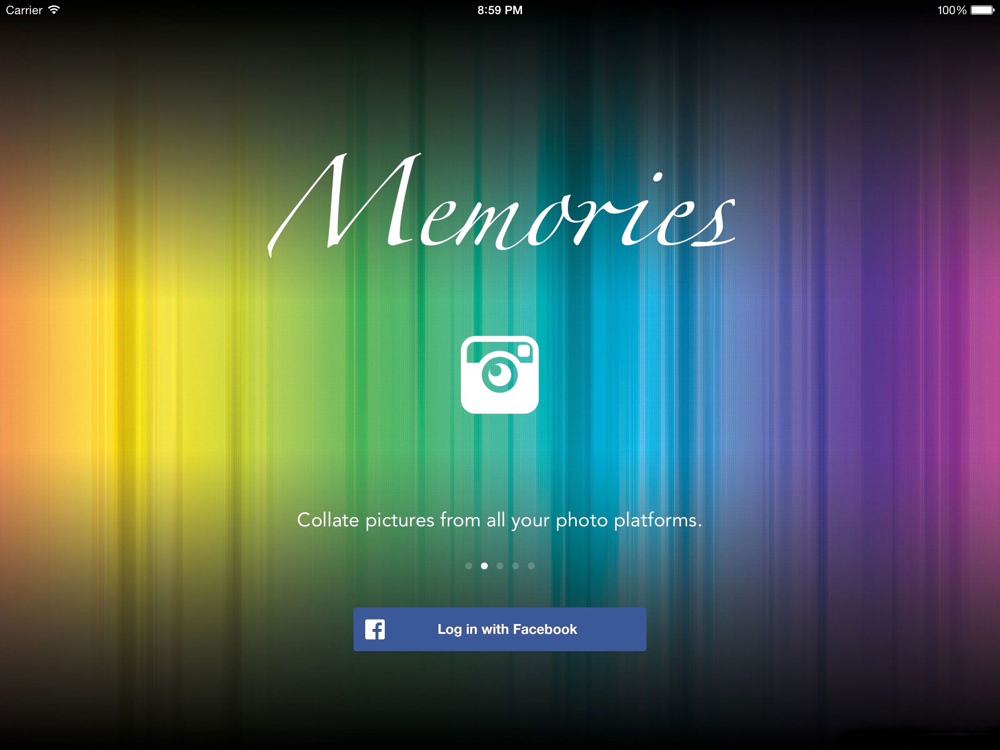
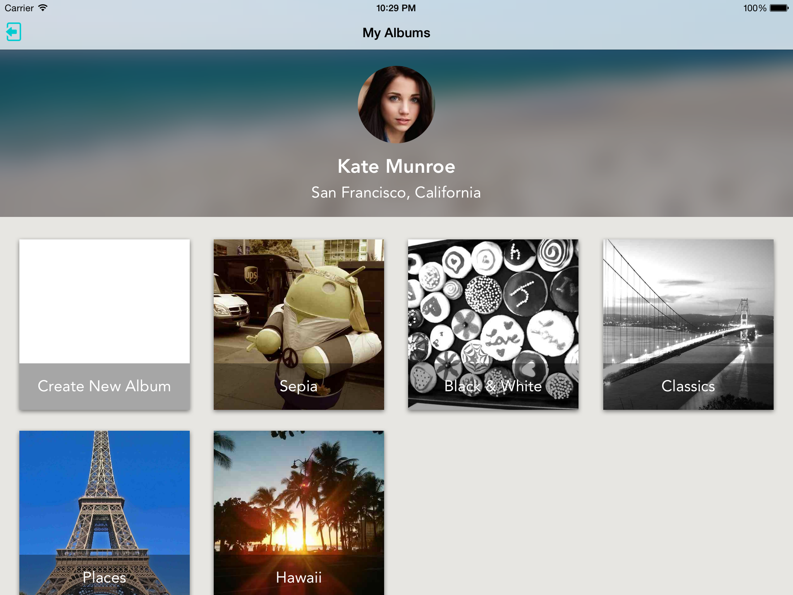
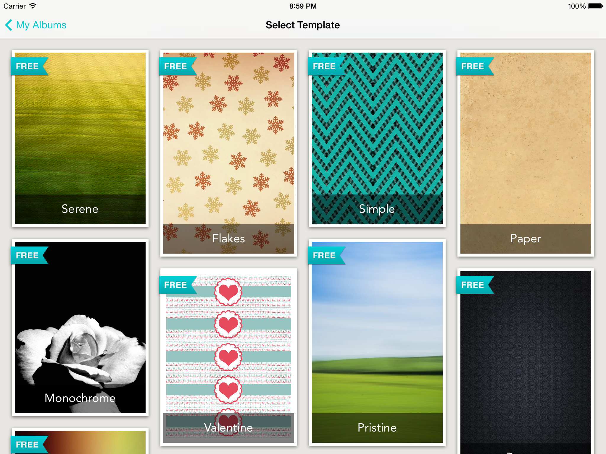
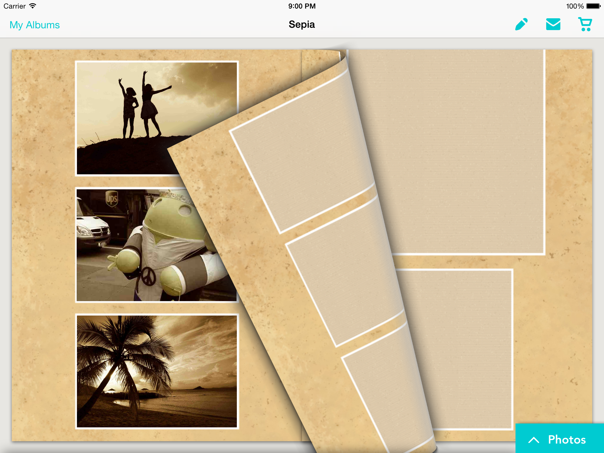

Memories
========

An iPad app for collating pictures from all your photo platforms into a beautiful album that can be printed and shipped right to your doorstep.
Built as part of the [iOS CodePath Bootcamp](http://thecodepath.com/iosbootcamp). Released on the [iTunes App Store](https://itunes.apple.com/us/app/memories-your-interactive/id835971846).

## Technologies

* [Parse Data] (https://parse.com)
* [Parse Cloud Code] (https://parse.com/docs/cloud_code_guide)
* [Stripe] (https://stripe.com/docs/mobile/ios)
* [Peecho] (http://www.peecho.com/)
* [Photo Picker Plus] (https://github.com/chute/photo-picker-plus-ios)
* [TMQuiltView] (https://github.com/1000Memories/TMQuiltView)

## Screenshots

